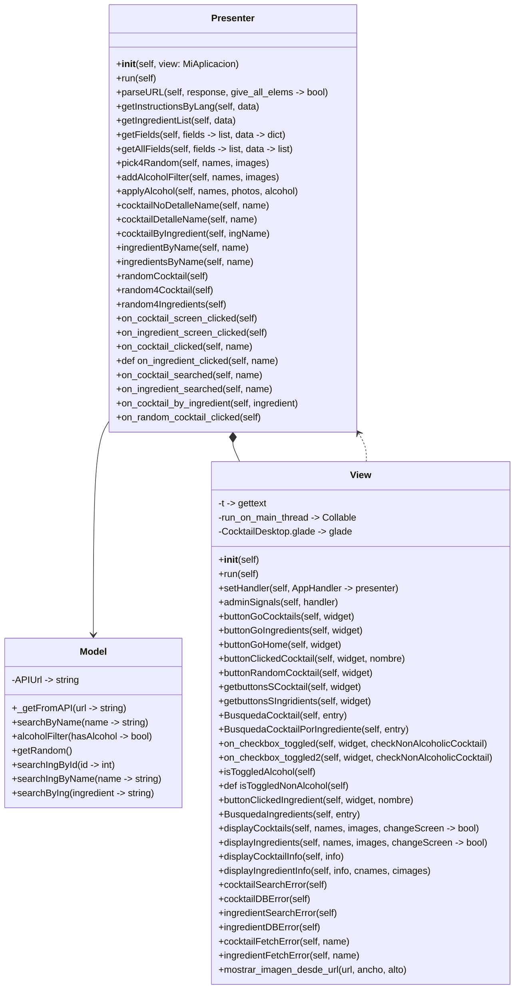
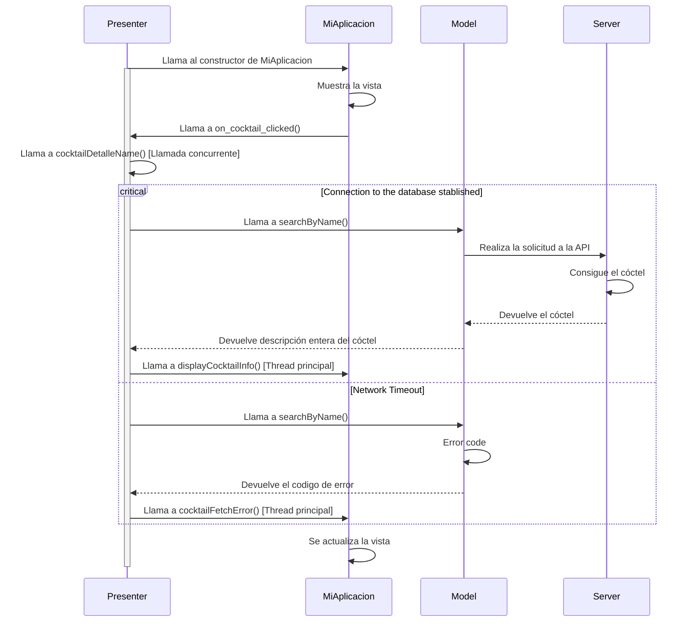
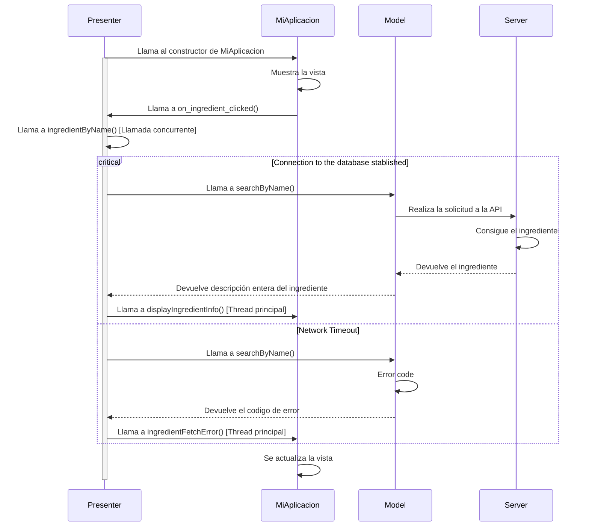
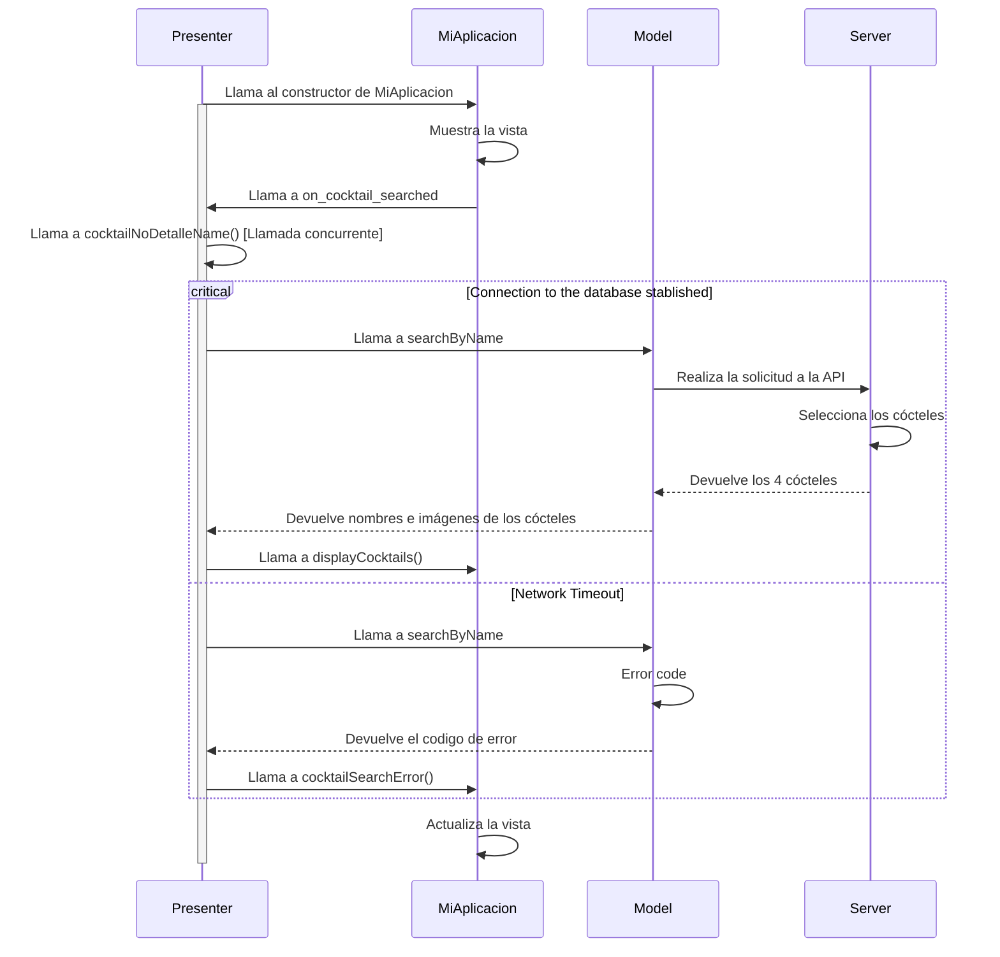
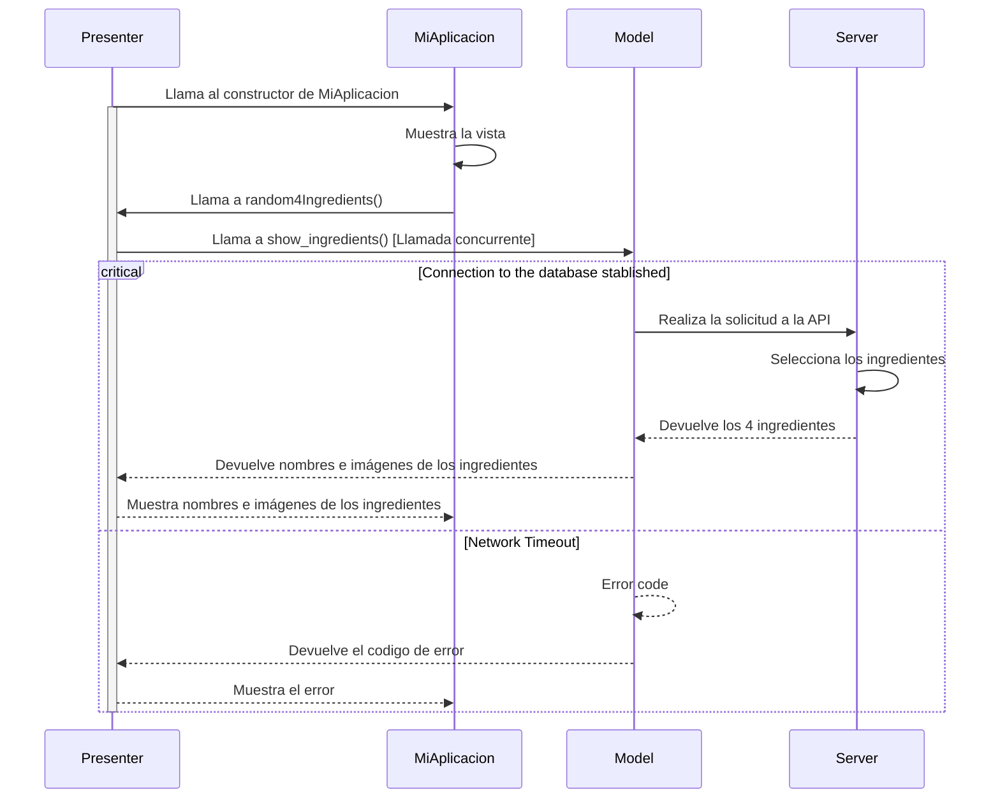
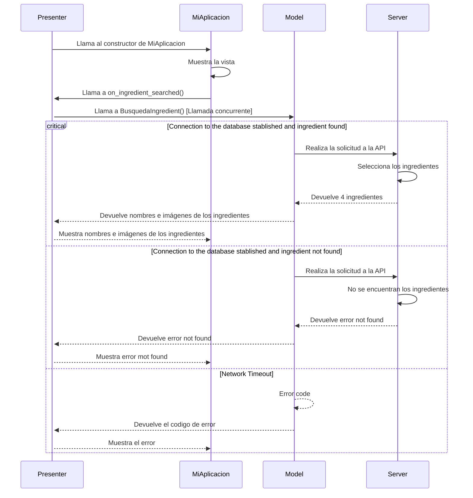
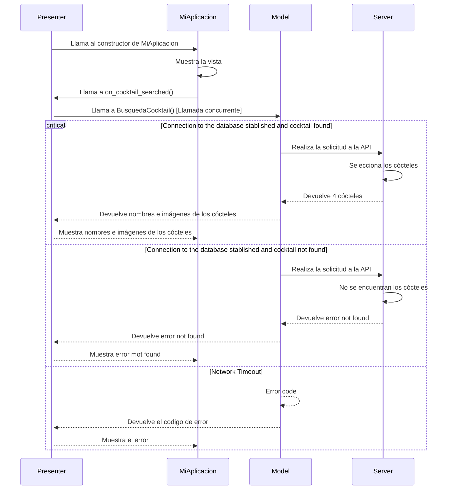

# Diseño software
## Diagrama estático
### Diagrama de clases

## Diagramas dinámicos
### Diagrama de secuencia
### Cóctel Detalle ✅

### Ingrediente Detalle ✅

### Mostrar pantalla cócteles✅

### Mostrar pantalla ingredientes

### Buscar Ingredientes

### Buscar Cócteles

