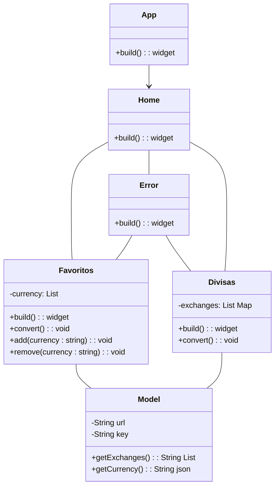
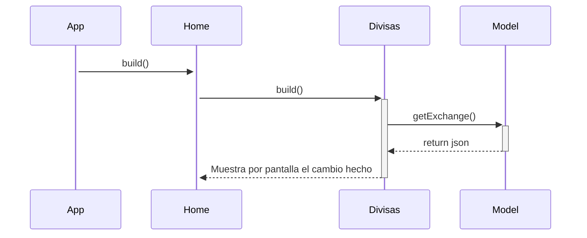

# Diseño software
## Diagrama estático

```mermaid
classDiagram

App --> Home
Home -- Error
Home -- Favoritos
Error -- Favoritos
Error -- Divisas

Favoritos -- Model
Divisas -- Model
Home -- Divisas

class App {
+build(): widget
}

class Home {
+build(): widget
}

class Error {
+build(): widget
}

class Divisas {
-exchanges: List Map
+build(): widget
+convert(): void
}

class Favoritos {
-currency: List
+build(): widget
+convert(): void
+add(currency : string): void
+remove(currency : string): void
}

class Model {
-String url
-String key
+getExchanges(): String List
+getCurrency(): String json
}

```

## Diagramas dinámicos
### Diagrama de secuencia

### Realizar un cambio de divisa

```mermaid
sequenceDiagram

    participant App as App
    participant Home as Home
    participant Divisas as Divisas
    participant Model as Model

    activate App
    
    App ->>+ Home: build()
    Home ->>+ Divisas: build()
    Divisas ->>+ Model: getExchange()
    Model -->>- Divisas: return json
    Divisas -->>- Home: Muestra por pantalla el cambio hecho

```
