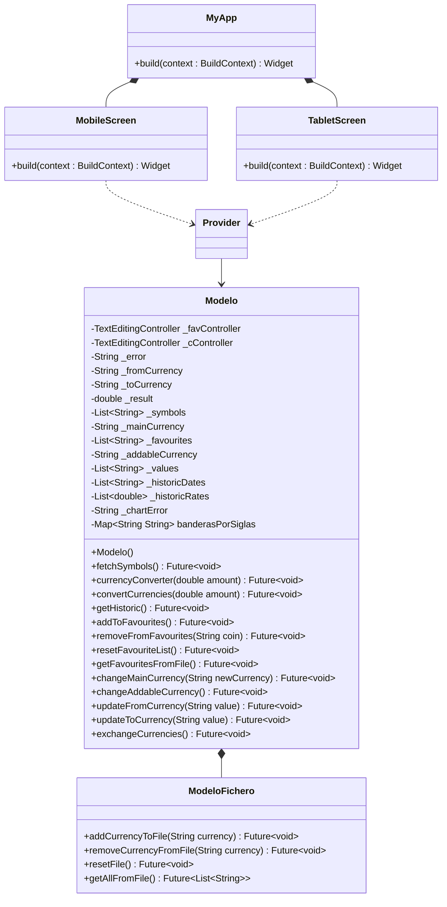
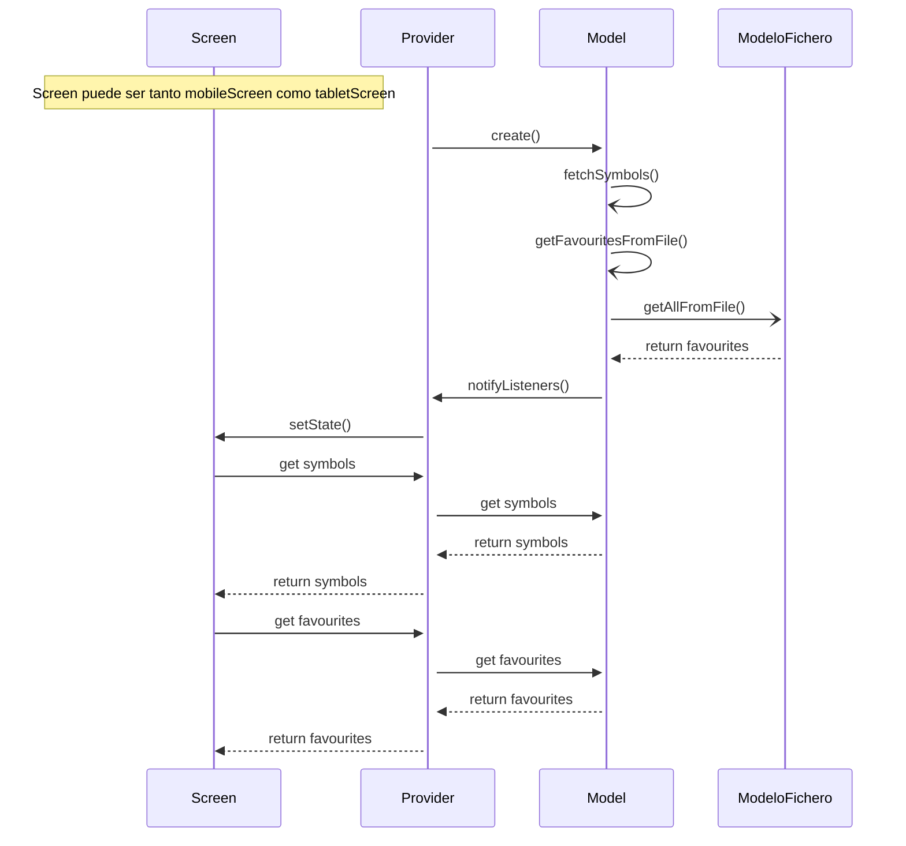
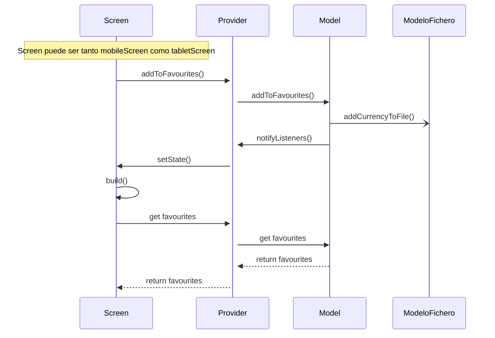
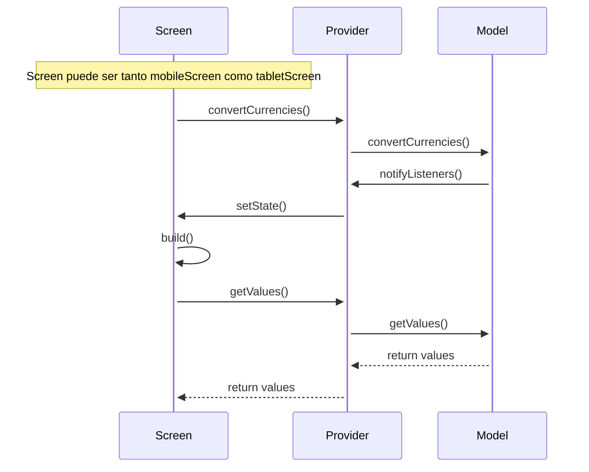
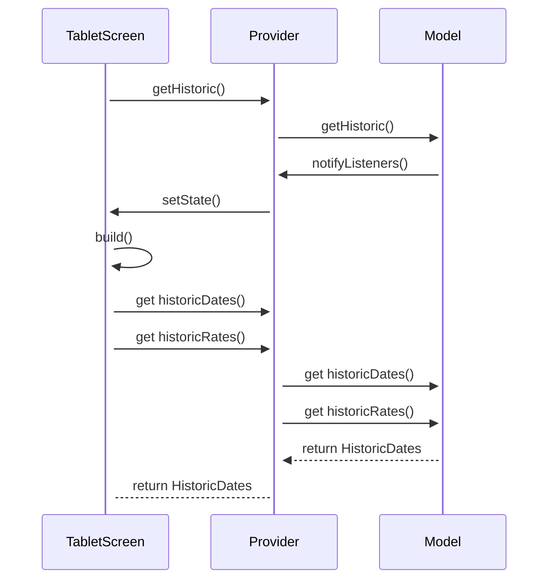

# Diseño software
## Diagrama estático

```mermaid
classDiagram

MyApp *-- MobileScreen
MyApp *-- TabletScreen
MobileScreen ..> Provider
TabletScreen ..> Provider
Provider --> Modelo
Modelo *-- ModeloFichero

class MyApp {
+build(context : BuildContext) Widget
}

class MobileScreen {
+build(context : BuildContext) Widget
}

class TabletScreen {
+build(context : BuildContext) Widget
}

class Modelo {
    
-TextEditingController _favController
-TextEditingController _cController
-String _error
-String _fromCurrency
-String _toCurrency
-double _result
-List~String~ _symbols
-String _mainCurrency
-List~String~ _favourites
-String _addableCurrency
-List~String~ _values
-List~String~ _historicDates
-List~double~ _historicRates
-String _chartError
-Map&lt;String String&gt; banderasPorSiglas

+Modelo()
+fetchSymbols() Future~void~ 
+currencyConverter(double amount) Future~void~ 
+convertCurrencies(double amount) Future~void~ 
+getHistoric() Future~void~
+addToFavourites() Future~void~ 
+removeFromFavourites(String coin) Future~void~ 
+resetFavouriteList() Future~void~ 
+getFavouritesFromFile() Future~void~ 
+changeMainCurrency(String newCurrency) Future~void~ 
+changeAddableCurrency() Future~void~ 
+updateFromCurrency(String value) Future~void~ 
+updateToCurrency(String value) Future~void~ 
+exchangeCurrencies() Future~void~ 
}

class ModeloFichero{
    +addCurrencyToFile(String currency) Future~void~ 
    +removeCurrencyFromFile(String currency) Future~void~ 
    +resetFile() Future~void~ 
    +getAllFromFile() Future~List~String~~
}
```

## Diagramas dinámicos
### Diagrama de secuencia

### Iniciar App

```mermaid
sequenceDiagram

    participant Screen as Screen
    participant Provider as Provider
    participant Model as Model
    participant ModeloFichero as ModeloFichero

    Note over Screen: Screen puede ser tanto mobileScreen como tabletScreen
    activate Provider

    Provider ->>+ Model: create()
    Model -) Model: fetchSymbols()
    Model -) Model: getFavouritesFromFile()
    Model -)+ ModeloFichero: getAllFromFile()
    ModeloFichero -->> Model: return favourites 
    Model ->>+ Provider: notifyListeners()
    Provider ->> Screen: setState()
    Screen ->> Provider: get symbols
    Provider ->> Model: get symbols
    Model -->>Provider: return symbols
    Provider -->> Screen: return symbols
    Screen ->> Provider: get favourites
    Provider ->> Model: get favourites
    Model -->>Provider: return favourites
    Provider -->> Screen: return favourites
    
```

### Añadir a favoritos

```mermaid
sequenceDiagram

    participant Screen as Screen
    participant Provider as Provider
    participant Model as Model
    participant ModeloFichero as ModeloFichero

    Note over Screen: Screen puede ser tanto mobileScreen como tabletScreen
    activate Provider

    Screen ->>+ Provider: addToFavourites()
    Provider ->> Model: addToFavourites()
    Model -) ModeloFichero: addCurrencyToFile()
    Model ->>Provider: notifyListeners()
    Provider ->> Screen: setState()
    Screen ->> Screen: build()
    Screen ->> Provider: get favourites
    Provider ->> Model: get favourites
    Model -->>Provider: return favourites
    Provider -->> Screen: return favourites

    
```

### Cambiar monedas

```mermaid
sequenceDiagram

    participant Screen as Screen
    participant Provider as Provider
    participant Model as Model

Note over Screen: Screen puede ser tanto mobileScreen como tabletScreen


    activate Screen

    Screen ->>+ Provider: convertCurrencies()
    Provider ->>+ Model: convertCurrencies()
    Model ->> Provider: notifyListeners()
    Provider ->> Screen: setState()
    Screen ->> Screen: build()
    Screen ->> Provider: getValues()
    Provider ->> Model: getValues()
    Model -->> Provider: return values
    Provider -->> Screen: return values

```

### Obtener gráfico

```mermaid
sequenceDiagram

    participant TabletScreen as TabletScreen
    participant Provider as Provider
    participant Model as Model

    activate TabletScreen

    TabletScreen ->>+ Provider: getHistoric()
    Provider ->>+ Model: getHistoric()
    Model ->>+ Provider: notifyListeners()
    Provider ->>+ TabletScreen: setState()
    TabletScreen ->> TabletScreen: build()
    TabletScreen ->> Provider: get historicDates()
    TabletScreen ->> Provider: get historicRates()
    Provider ->> Model: get historicDates()
    Provider ->> Model: get historicRates()
    Model -->> Provider: return HistoricDates
    Provider --> TabletScreen: return HistoricDates
```
