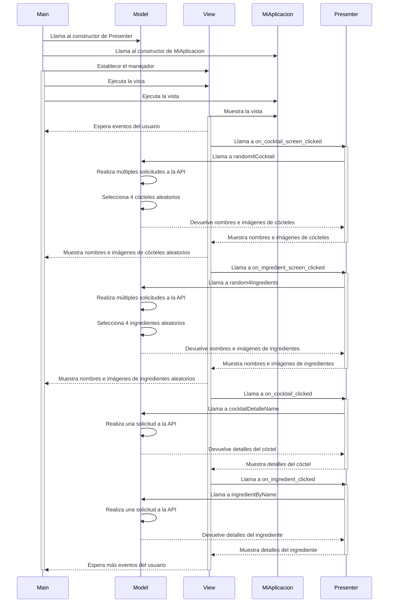

```mermaid
sequenceDiagram
    participant Main as Main
    participant Model as Model
    participant View as View
    participant MiAplicacion as MiAplicacion

    Main->>Model: Llama al constructor de Presenter
    Main->>MiAplicacion: Llama al constructor de MiAplicacion
    Main->>View: Establece el manejador

    activate Main

    Main->>View: Ejecuta la vista
    Main->>MiAplicacion: Ejecuta la vista
    View->>MiAplicacion: Muestra la vista

    activate View

    View-->>Main: Espera eventos del usuario
    View->>Presenter: Llama a on_cocktail_screen_clicked
    activate Presenter
    Presenter->>Model: Llama a random4Cocktail
    Model->>Model: Realiza múltiples solicitudes a la API
    Model->>Model: Selecciona 4 cócteles aleatorios
    Model-->>Presenter: Devuelve nombres e imágenes de cócteles
    Presenter-->>View: Muestra nombres e imágenes de cócteles
    deactivate Presenter
    View-->>Main: Muestra nombres e imágenes de cócteles aleatorios

    View->>Presenter: Llama a on_ingredient_screen_clicked
    activate Presenter
    Presenter->>Model: Llama a random4Ingredients
    Model->>Model: Realiza múltiples solicitudes a la API
    Model->>Model: Selecciona 4 ingredientes aleatorios
    Model-->>Presenter: Devuelve nombres e imágenes de ingredientes
    Presenter-->>View: Muestra nombres e imágenes de ingredientes
    deactivate Presenter
    View-->>Main: Muestra nombres e imágenes de ingredientes aleatorios

    View->>Presenter: Llama a on_cocktail_clicked
    activate Presenter
    Presenter->>Model: Llama a cocktailDetalleName
    Model->>Model: Realiza una solicitud a la API
    Model-->>Presenter: Devuelve detalles del cóctel
    Presenter-->>View: Muestra detalles del cóctel
    deactivate Presenter

    View->>Presenter: Llama a on_ingredient_clicked
    activate Presenter
    Presenter->>Model: Llama a ingredientByName
    Model->>Model: Realiza una solicitud a la API
    Model-->>Presenter: Devuelve detalles del ingrediente
    Presenter-->>View: Muestra detalles del ingrediente
    deactivate Presenter

    View-->>Main: Espera más eventos del usuario
    deactivate View
    deactivate Main
```    
