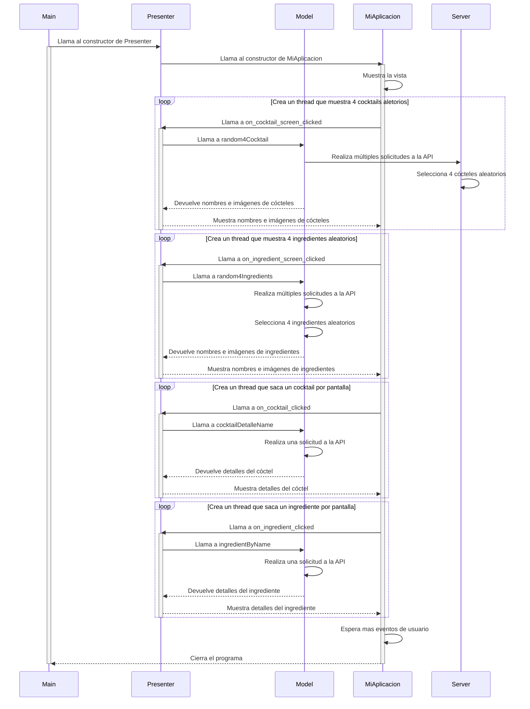

```mermaid
sequenceDiagram
    participant Main as Main
    participant Presenter as Presenter
    participant Model as Model
    participant MiAplicacion as MiAplicacion
    participant Server as Server

    Main->>Presenter: Llama al constructor de Presenter
    activate Main

    Presenter->>MiAplicacion: Llama al constructor de MiAplicacion

    activate MiAplicacion

    MiAplicacion->>MiAplicacion: Muestra la vista

    loop Crea un thread que muestra 4 cocktails aletorios
        MiAplicacion->>Presenter: Llama a on_cocktail_screen_clicked
        activate Presenter
        Presenter->>Model: Llama a random4Cocktail
        Model->>Server: Realiza múltiples solicitudes a la API
        Server->>Server: Selecciona 4 cócteles aleatorios
        Model-->>Presenter: Devuelve nombres e imágenes de cócteles
        Presenter-->>MiAplicacion: Muestra nombres e imágenes de cócteles
    end
    deactivate Presenter
    
    loop Crea un thread que muestra 4 ingredientes aleatorios
        MiAplicacion->>Presenter: Llama a on_ingredient_screen_clicked
        activate Presenter
        Presenter->>Model: Llama a random4Ingredients
        Model->>Model: Realiza múltiples solicitudes a la API
        Model->>Model: Selecciona 4 ingredientes aleatorios
        Model-->>Presenter: Devuelve nombres e imágenes de ingredientes
        Presenter-->>MiAplicacion: Muestra nombres e imágenes de ingredientes
    end
    deactivate Presenter
    
    loop Crea un thread que saca un cocktail por pantalla
        MiAplicacion->>Presenter: Llama a on_cocktail_clicked
        activate Presenter
        Presenter->>Model: Llama a cocktailDetalleName
        Model->>Model: Realiza una solicitud a la API
        Model-->>Presenter: Devuelve detalles del cóctel
        Presenter-->>MiAplicacion: Muestra detalles del cóctel
    end
    deactivate Presenter

    loop Crea un thread que saca un ingrediente por pantalla
        MiAplicacion->>Presenter: Llama a on_ingredient_clicked
        activate Presenter
        Presenter->>Model: Llama a ingredientByName
        Model->>Model: Realiza una solicitud a la API
        Model-->>Presenter: Devuelve detalles del ingrediente
        Presenter-->>MiAplicacion: Muestra detalles del ingrediente
    end
    deactivate Presenter

    MiAplicacion->>MiAplicacion: Espera mas eventos de usuario
    MiAplicacion-->>Main: Cierra el programa
    deactivate MiAplicacion
    deactivate Main

```    
