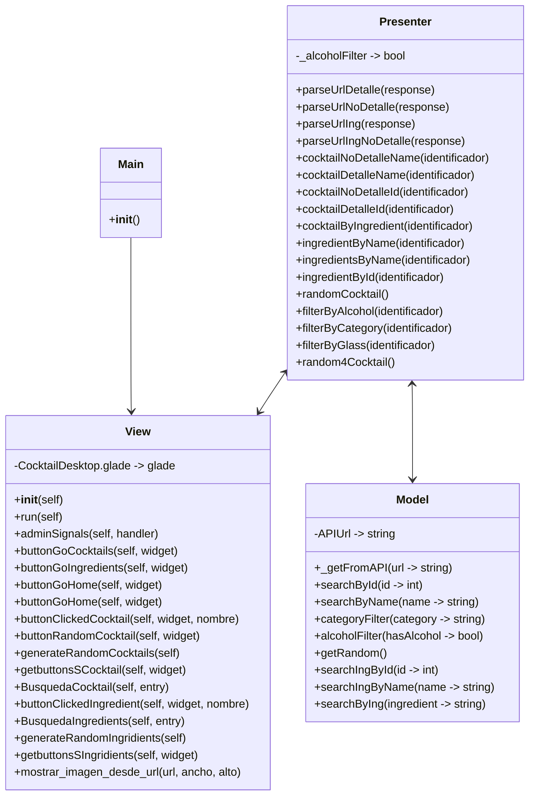
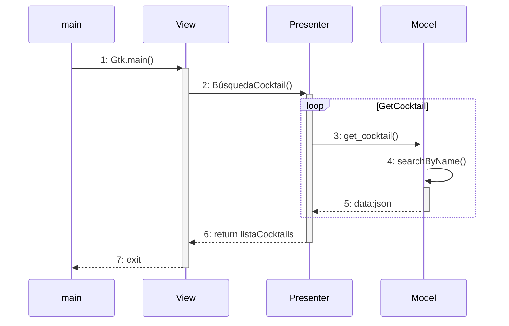
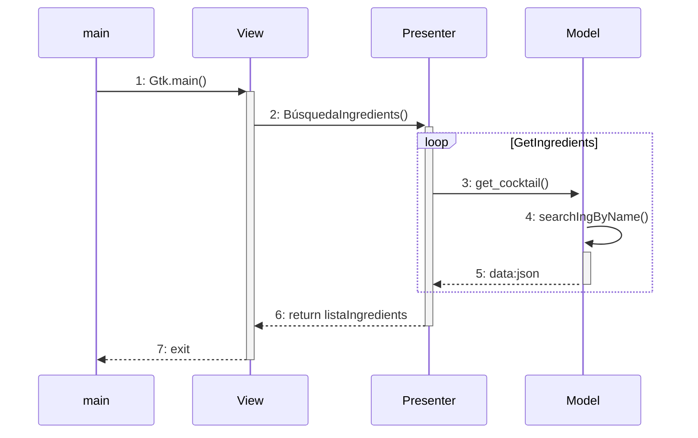
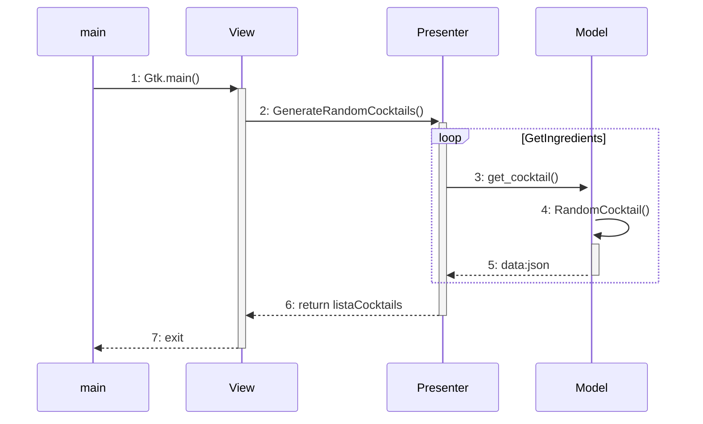

# Diseño software

## Diagrama estático
### Diagrama de clases

```mermaid
classDiagram
    Main --> View
    Presenter <--> View
    Presenter <--> Model

    class Main{
    +__init__()
}

    class Presenter{
    -_alcoholFilter -> bool
    +parseUrlDetalle(response)
    +parseUrlNoDetalle(response)
    +parseUrlIng(response)
    +parseUrlIngNoDetalle(response)
    +cocktailNoDetalleName(identificador)
    +cocktailDetalleName(identificador)
    +cocktailNoDetalleId(identificador)
    +cocktailDetalleId(identificador)
    +cocktailByIngredient(identificador)
    +ingredientByName(identificador)
    +ingredientsByName(identificador)
    +ingredientById(identificador)
    +randomCocktail()
    +filterByAlcohol(identificador)
    +filterByCategory(identificador)
    +filterByGlass(identificador)
    +random4Cocktail()
    
}
    class View{
    -CocktailDesktop.glade -> glade
    +__init__(self)
    +run(self)
    +adminSignals(self, handler)
    +buttonGoCocktails(self, widget)
    +buttonGoIngredients(self, widget)
    +buttonGoHome(self, widget)
    +buttonGoHome(self, widget)
    +buttonClickedCocktail(self, widget, nombre)
    +buttonRandomCocktail(self, widget)
    +generateRandomCocktails(self)
    +getbuttonsSCocktail(self, widget)
    +BusquedaCocktail(self, entry)
    +buttonClickedIngredient(self, widget, nombre)
    +BusquedaIngredients(self, entry)
    +generateRandomIngridients(self)
    +getbuttonsSIngridients(self, widget)
    +mostrar_imagen_desde_url(url, ancho, alto)
}
    class Model{
     -APIUrl -> string
     +_getFromAPI(url -> string)
     +searchById(id -> int)
     +searchByName(name -> string)
     +categoryFilter(category -> string)
     +alcoholFilter(hasAlcohol -> bool)
     +getRandom()
     +searchIngById(id -> int)
     +searchIngByName(name -> string)
     +searchByIng(ingredient -> string)
    
}
```

## Diagramas dinámicos
### Búsqueda Cocktail

```mermaid
sequenceDiagram
    main->>+View: 1: Gtk.main()
    View->>+Presenter: 2: BúsquedaCocktail()
    loop GetCocktail
    Presenter->>+Model: 3: get_cocktail()
    Model->>+Model: 4: searchByName()
    Model-->>-Presenter: 5: data:json
    end
    Presenter-->>-View: 6: return listaCocktails
    View-->>-main: 7: exit
```
### Búsqueda Ingredientes

```mermaid
sequenceDiagram
    main->>+View: 1: Gtk.main()
    View->>+Presenter: 2: BúsquedaIngredients()
    loop GetIngredients
    Presenter->>+Model: 3: get_cocktail()
    Model->>+Model: 4: searchIngByName()
    Model-->>-Presenter: 5: data:json
    end
    Presenter-->>-View: 6: return listaIngredients
    View-->>-main: 7: exit
```    
### Cocktail Random

```mermaid
sequenceDiagram
    main->>+View: 1: Gtk.main()
    View->>+Presenter: 2: GenerateRandomCocktails()
    loop GetIngredients
    Presenter->>+Model: 3: get_cocktail()
    Model->>+Model: 4: RandomCocktail()
    Model-->>-Presenter: 5: data:json
    end
    Presenter-->>-View: 6: return listaCocktails
    View-->>-main: 7: exit
```    
