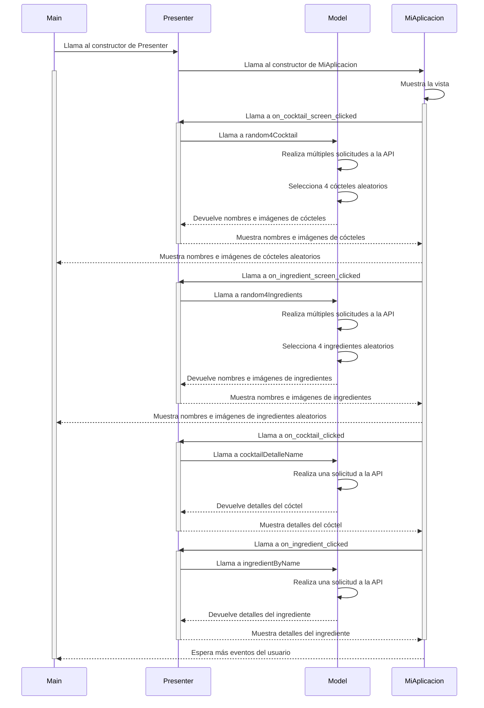

```mermaid
sequenceDiagram
    participant Main as Main
    participant Presenter as Presenter
    participant Model as Model
    participant MiAplicacion as MiAplicacion
    

    Main->>Presenter: Llama al constructor de Presenter
    Presenter->>MiAplicacion: Llama al constructor de MiAplicacion
    

    activate Main

    
    MiAplicacion->>MiAplicacion: Muestra la vista

    activate MiAplicacion

    MiAplicacion->>Presenter: Llama a on_cocktail_screen_clicked
    activate Presenter
    Presenter->>Model: Llama a random4Cocktail
    Model->>Model: Realiza múltiples solicitudes a la API
    Model->>Model: Selecciona 4 cócteles aleatorios
    Model-->>Presenter: Devuelve nombres e imágenes de cócteles
    Presenter-->>MiAplicacion: Muestra nombres e imágenes de cócteles
    deactivate Presenter
    MiAplicacion-->>Main: Muestra nombres e imágenes de cócteles aleatorios

    MiAplicacion->>Presenter: Llama a on_ingredient_screen_clicked
    activate Presenter
    Presenter->>Model: Llama a random4Ingredients
    Model->>Model: Realiza múltiples solicitudes a la API
    Model->>Model: Selecciona 4 ingredientes aleatorios
    Model-->>Presenter: Devuelve nombres e imágenes de ingredientes
    Presenter-->>MiAplicacion: Muestra nombres e imágenes de ingredientes
    deactivate Presenter
    MiAplicacion-->>Main: Muestra nombres e imágenes de ingredientes aleatorios

    MiAplicacion->>Presenter: Llama a on_cocktail_clicked
    activate Presenter
    Presenter->>Model: Llama a cocktailDetalleName
    Model->>Model: Realiza una solicitud a la API
    Model-->>Presenter: Devuelve detalles del cóctel
    Presenter-->>MiAplicacion: Muestra detalles del cóctel
    deactivate Presenter

    MiAplicacion->>Presenter: Llama a on_ingredient_clicked
    activate Presenter
    Presenter->>Model: Llama a ingredientByName
    Model->>Model: Realiza una solicitud a la API
    Model-->>Presenter: Devuelve detalles del ingrediente
    Presenter-->>MiAplicacion: Muestra detalles del ingrediente
    deactivate Presenter

    deactivate MiAplicacion
    MiAplicacion-->>Main: Espera más eventos del usuario
    deactivate Main

```    
