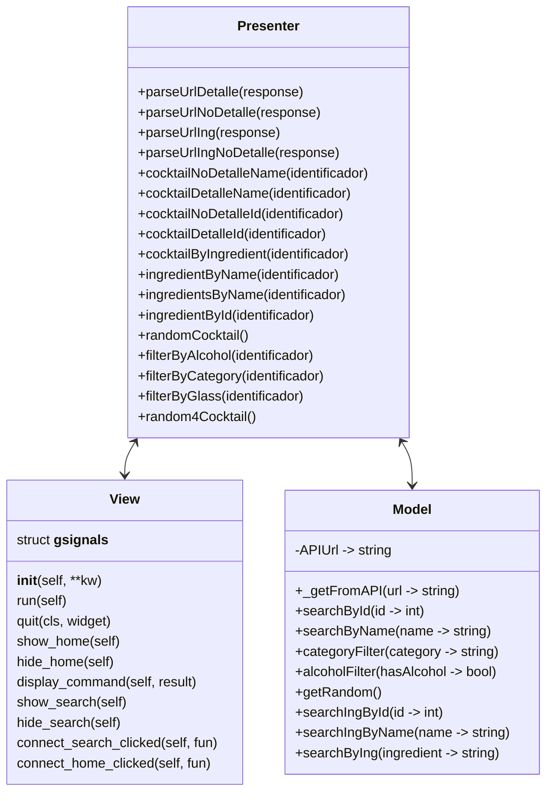
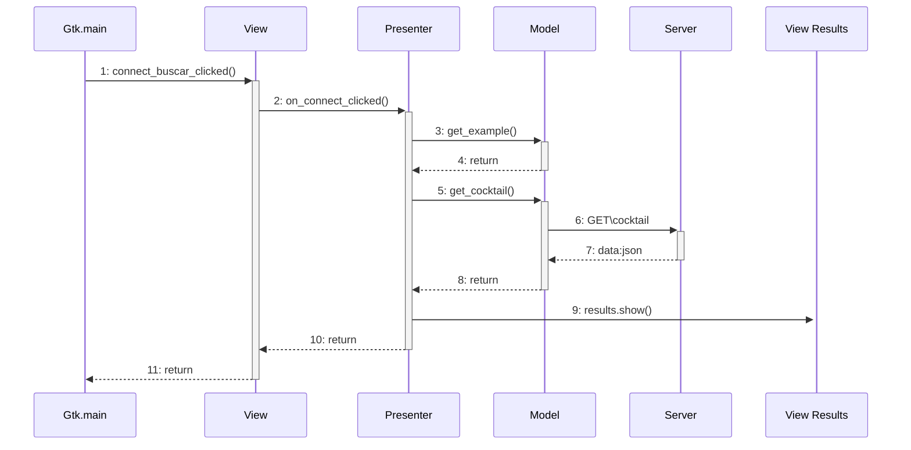

# Diseño software

## Diagrama estático
### Diagrama de clases

```mermaid
classDiagram
    Presenter <--> View
    Presenter <--> Model

    class Presenter{
    +parseUrlDetalle(response)
    +parseUrlNoDetalle(response)
    +parseUrlIng(response)
    +parseUrlIngNoDetalle(response)
    +cocktailNoDetalleName(identificador)
    +cocktailDetalleName(identificador)
    +cocktailNoDetalleId(identificador)
    +cocktailDetalleId(identificador)
    +cocktailByIngredient(identificador)
    +ingredientByName(identificador)
    +ingredientsByName(identificador)
    +ingredientById(identificador)
    +randomCocktail()
    +filterByAlcohol(identificador)
    +filterByCategory(identificador)
    +filterByGlass(identificador)
    +random4Cocktail()
    
}
    class View{
      struct __gsignals__
      __init__(self, **kw)
      run(self)
      quit(cls, widget)
      show_home(self)
      hide_home(self)
      display_command(self, result)
      show_search(self)
      hide_search(self)
      connect_search_clicked(self, fun)
      connect_home_clicked(self, fun)
}
    class Model{
     -APIUrl -> string
     +_getFromAPI(url -> string)
     +searchById(id -> int)
     +searchByName(name -> string)
     +categoryFilter(category -> string)
     +alcoholFilter(hasAlcohol -> bool)
     +getRandom()
     +searchIngById(id -> int)
     +searchIngByName(name -> string)
     +searchByIng(ingredient -> string)
    
}
```

## Diagramas dinámicos
### Diagrama de clases

```mermaid
sequenceDiagram
    Gtk.main->>+View: 1: connect_buscar_clicked()
    View->>+Presenter: 2: on_connect_clicked()
    Presenter->>+Model: 3: get_example()
    Model-->>-Presenter: 4: return
    Presenter->>+Model: 5: get_cocktail()
    Model->>+Server: 6: GET\cocktail
    Server-->>-Model: 7: data:json
    Model-->>-Presenter: 8: return
    Presenter->>+View Results: 9: results.show()
    Presenter-->>-View: 10: return
    View-->>-Gtk.main: 11: return
```    

