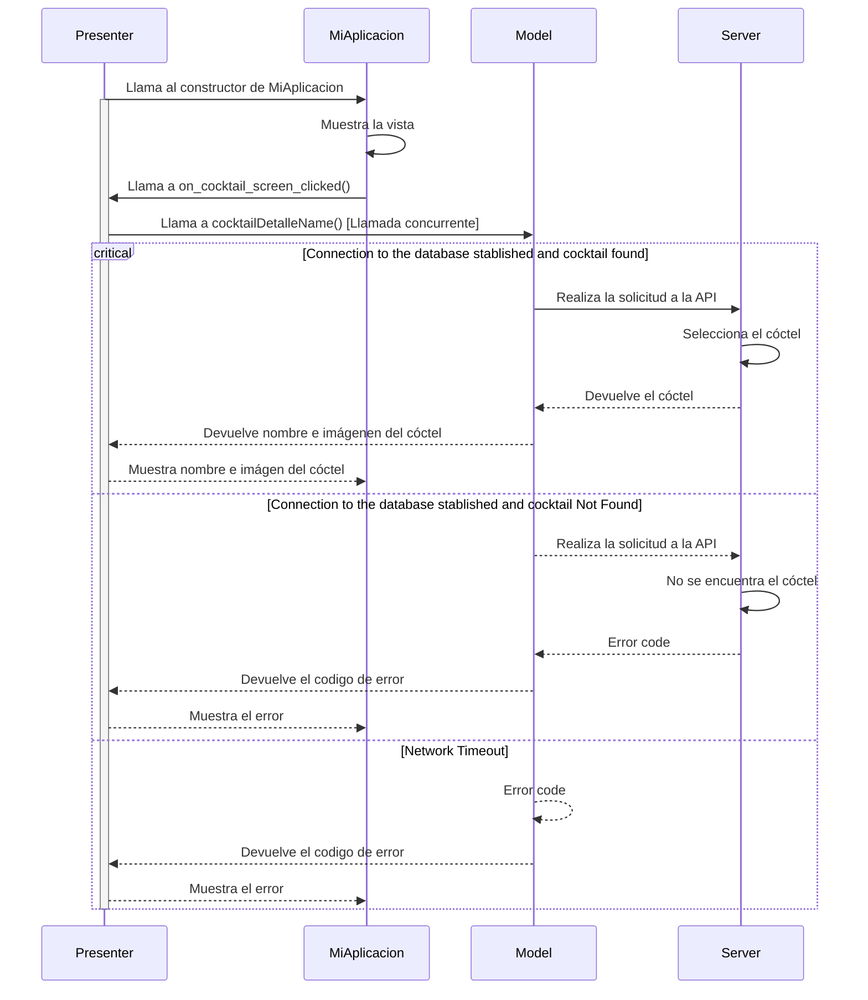
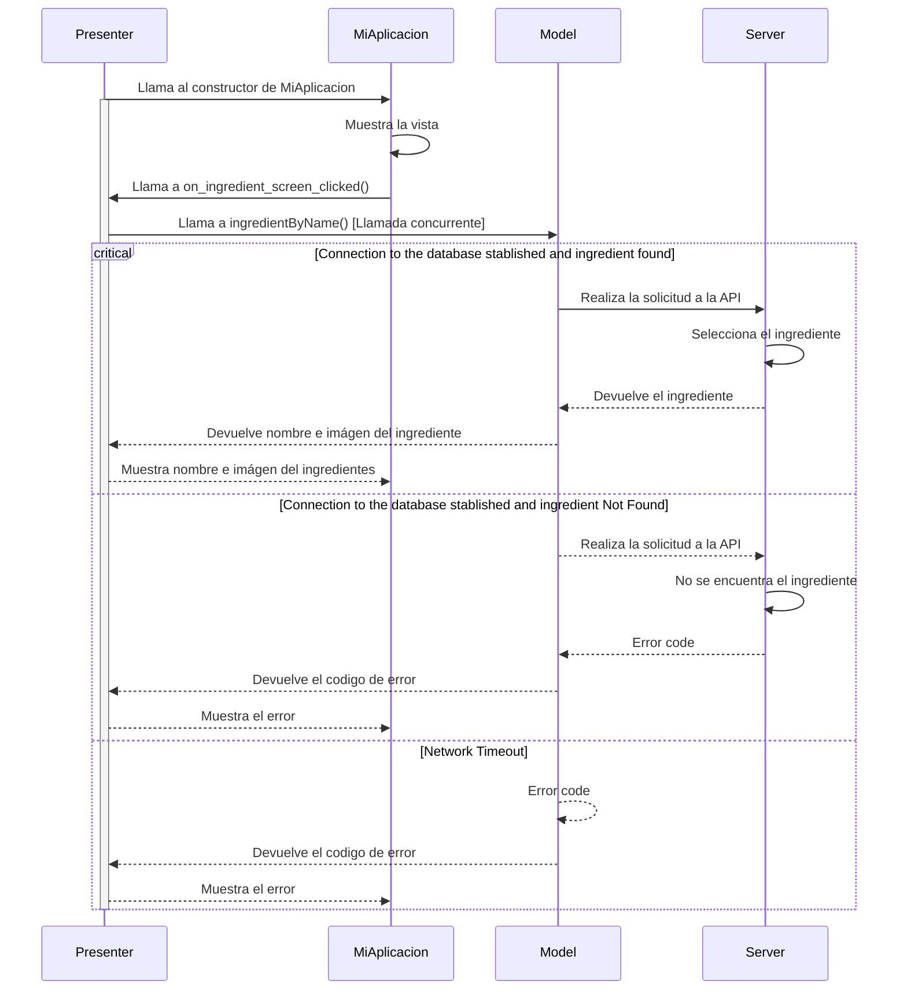
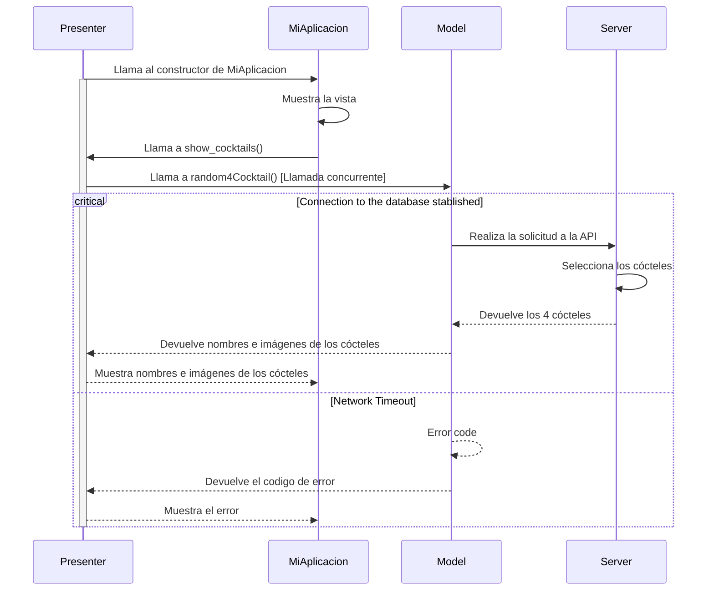
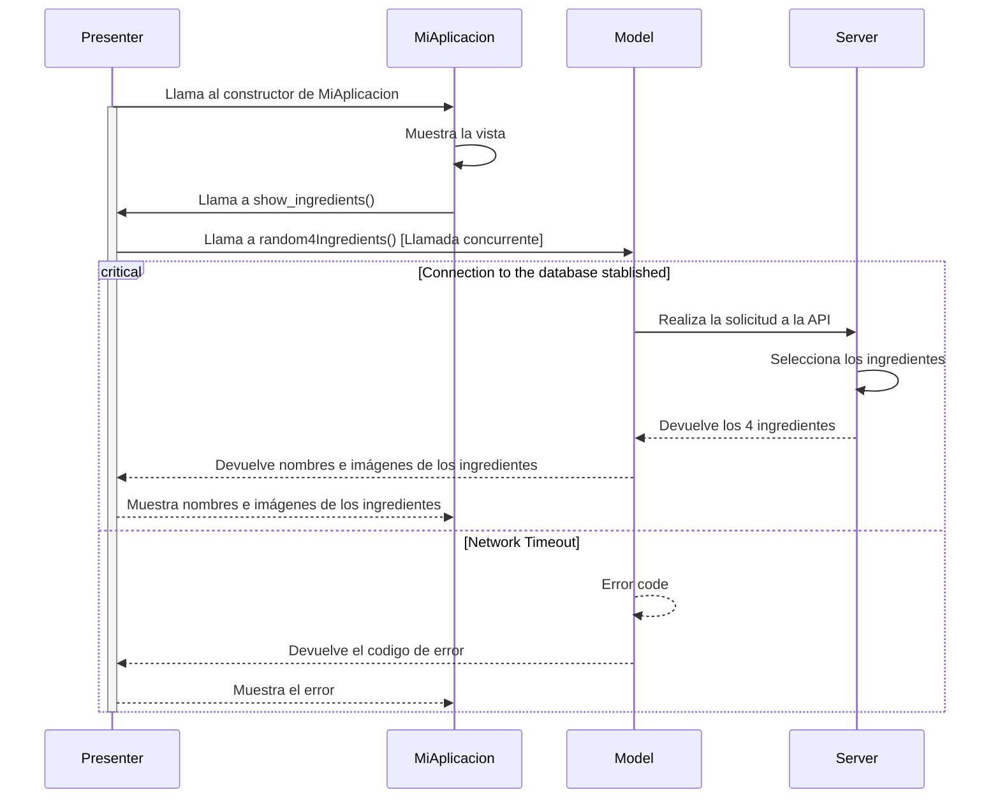

### Cóctel Detalle

```mermaid
sequenceDiagram

#--------------Definiciones de actores--------------#
    participant Presenter as Presenter
    participant MiAplicacion as MiAplicacion
    participant Model as Model
    participant Server as Server

#--------------Inicio de la aplicación--------------#
    Presenter->>MiAplicacion: Llama al constructor de MiAplicacion
    activate Presenter
    MiAplicacion->>MiAplicacion: Muestra la vista
    MiAplicacion->>Presenter: Llama a on_cocktail_screen_clicked()
    Presenter->>Model: Llama a cocktailDetalleName() [Llamada concurrente]

#-------------Accesos a la base de datos------------#        
    critical Connection to the database stablished and cocktail found
        Model->>Server: Realiza la solicitud a la API
        Server->>Server: Selecciona el cóctel
        Server-->>Model: Devuelve el cóctel
        Model-->>Presenter: Devuelve nombre e imágenen del cóctel
        Presenter-->>MiAplicacion: Muestra nombre e imágen del cóctel
    option Connection to the database stablished and cocktail Not Found   
            Model-->>Server: Realiza la solicitud a la API
            Server->>Server: No se encuentra el cóctel
            Server-->>Model: Error code
            Model-->>Presenter: Devuelve el codigo de error
            Presenter-->>MiAplicacion: Muestra el error
    option Network Timeout
            Model-->>Model: Error code
            Model-->>Presenter: Devuelve el codigo de error
            Presenter-->>MiAplicacion: Muestra el error
    end
   
    deactivate Presenter

```         
### Ingrediente Detalle

```mermaid
sequenceDiagram

#--------------Definiciones de actores--------------#
    participant Presenter as Presenter
    participant MiAplicacion as MiAplicacion
    participant Model as Model
    participant Server as Server

#--------------Inicio de la aplicación--------------#
    Presenter->>MiAplicacion: Llama al constructor de MiAplicacion
    activate Presenter
    MiAplicacion->>MiAplicacion: Muestra la vista
    MiAplicacion->>Presenter: Llama a on_ingredient_screen_clicked()
    Presenter->>Model: Llama a ingredientByName() [Llamada concurrente]

#-------------Accesos a la base de datos------------#        
    critical Connection to the database stablished and ingredient found
        Model->>Server: Realiza la solicitud a la API
        Server->>Server: Selecciona el ingrediente
        Server-->>Model: Devuelve el ingrediente
        Model-->>Presenter: Devuelve nombre e imágen del ingrediente
        Presenter-->>MiAplicacion: Muestra nombre e imágen del ingredientes
    option Connection to the database stablished and ingredient Not Found   
            Model-->>Server: Realiza la solicitud a la API
            Server->>Server: No se encuentra el ingrediente
            Server-->>Model: Error code
            Model-->>Presenter: Devuelve el codigo de error
            Presenter-->>MiAplicacion: Muestra el error
    option Network Timeout
            Model-->>Model: Error code
            Model-->>Presenter: Devuelve el codigo de error
            Presenter-->>MiAplicacion: Muestra el error
    end
   
    deactivate Presenter

```

### Mostrar pantalla cócteles

```mermaid
sequenceDiagram

#--------------Definiciones de actores--------------#
    participant Presenter as Presenter
    participant MiAplicacion as MiAplicacion
    participant Model as Model
    participant Server as Server

#--------------Inicio de la aplicación--------------#
    Presenter->>MiAplicacion: Llama al constructor de MiAplicacion
    activate Presenter
    MiAplicacion->>MiAplicacion: Muestra la vista
    MiAplicacion->>Presenter: Llama a show_cocktails()
    Presenter->>Model: Llama a random4Cocktail() [Llamada concurrente]

#-------------Accesos a la base de datos------------#        
    critical Connection to the database stablished
        Model->>Server: Realiza la solicitud a la API
        Server->>Server: Selecciona los cócteles
        Server-->>Model: Devuelve los 4 cócteles
        Model-->>Presenter: Devuelve nombres e imágenes de los cócteles
        Presenter-->>MiAplicacion: Muestra nombres e imágenes de los cócteles
    option Network Timeout   
            Model-->>Model: Error code
            Model-->>Presenter: Devuelve el codigo de error
            Presenter-->>MiAplicacion: Muestra el error
    end
   
    deactivate Presenter

```
### Mostrar pantalla ingredientes

```mermaid
sequenceDiagram

#--------------Definiciones de actores--------------#
    participant Presenter as Presenter
    participant MiAplicacion as MiAplicacion
    participant Model as Model
    participant Server as Server

#--------------Inicio de la aplicación--------------#
    Presenter->>MiAplicacion: Llama al constructor de MiAplicacion
    activate Presenter
    MiAplicacion->>MiAplicacion: Muestra la vista
    MiAplicacion->>Presenter: Llama a show_ingredients()
    Presenter->>Model: Llama a random4Ingredients() [Llamada concurrente]

#-------------Accesos a la base de datos------------#        
    critical Connection to the database stablished
        Model->>Server: Realiza la solicitud a la API
        Server->>Server: Selecciona los ingredientes
        Server-->>Model: Devuelve los 4 ingredientes
        Model-->>Presenter: Devuelve nombres e imágenes de los ingredientes
        Presenter-->>MiAplicacion: Muestra nombres e imágenes de los ingredientes
    option Network Timeout   
            Model-->>Model: Error code
            Model-->>Presenter: Devuelve el codigo de error
            Presenter-->>MiAplicacion: Muestra el error
    end
   
    deactivate Presenter

```
